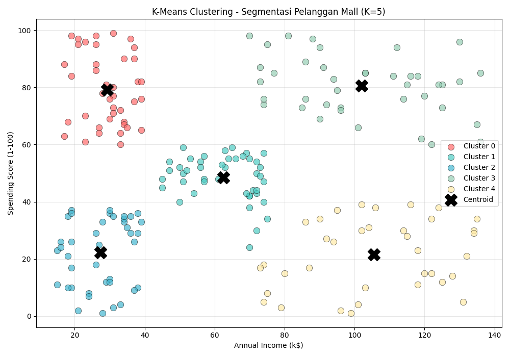
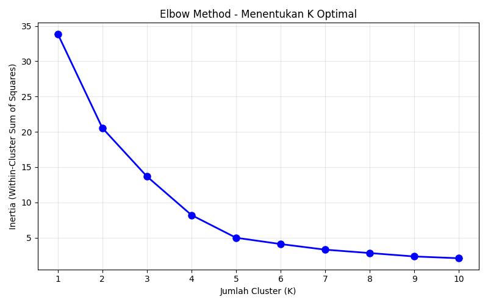
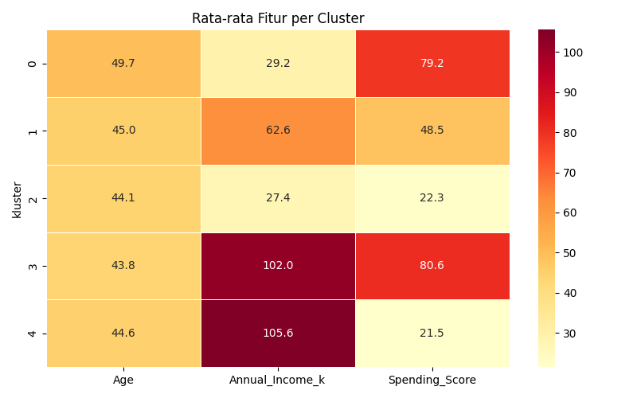

# K-Means Clustering - Segmentasi Pelanggan Mall

Implementasi K-Means Clustering menggunakan Python untuk melakukan segmentasi pelanggan berdasarkan data Annual Income dan Spending Score.

> **Tugas Praktikum:** Materi 11 — K-Means Clustering

---

## 📋 Deskripsi Dataset

**Dataset:** Mall Customers

Dataset ini berisi informasi pelanggan sebuah mall, dengan atribut:

| Kolom | Deskripsi |
|---|---|
| `CustomerID` | ID unik pelanggan |
| `Gender` | Jenis kelamin pelanggan |
| `Age` | Usia pelanggan |
| `Annual_Income_k` | Pendapatan tahunan (dalam ribuan dolar) |
| `Spending_Score` | Skor pengeluaran pelanggan (1–100) |

Dataset ini umum digunakan untuk **customer segmentation** — salah satu contoh klasik penerapan K-Means Clustering dalam dunia bisnis.

---

## 🎯 Tujuan

Mengelompokkan pelanggan ke dalam beberapa segmen berdasarkan kemiripan pola pendapatan dan pengeluaran, untuk membantu strategi pemasaran yang lebih efektif.

---

## 🔧 Library yang Digunakan

```python
import pandas as pd
import numpy as np
import seaborn as sns
import matplotlib.pyplot as plt
from sklearn.cluster import KMeans
from sklearn.preprocessing import MinMaxScaler
```

---

## 🚀 Cara Menjalankan

### 1. Clone Repository

```bash
git clone https://github.com/username/kmeans-mall-customers.git
cd kmeans-mall-customers
```

### 2. Install Dependencies

```bash
pip install -r requirements.txt
```

### 3. Jalankan Script

**Opsi A — Python Script:**
```bash
python kmeans_mall_customers.py
```

**Opsi B — Jupyter Notebook:**
```bash
jupyter notebook kmeans_mall_customers.ipynb
```

---

## 📊 Alur Analisis

```
1. Load Dataset
       ↓
2. Preprocessing (drop kolom tidak relevan)
       ↓
3. Visualisasi Data Awal (scatter plot)
       ↓
4. Normalisasi Data (MinMaxScaler)
       ↓
5. Elbow Method (tentukan K optimal)
       ↓
6. Membuat Model K-Means (K=5)
       ↓
7. Visualisasi Hasil Clustering
       ↓
8. Analisis per Cluster (heatmap)
```

---

## 📈 Hasil Clustering

Berdasarkan Elbow Method, nilai **K=5** dipilih sebagai jumlah cluster optimal.

### Visualisasi Hasil



### Interpretasi Cluster

| Cluster | Annual Income | Spending Score | Deskripsi |
|---|---|---|---|
| 0 | Rendah | Tinggi | Pelanggan berpenghasilan rendah tapi boros |
| 1 | Menengah | Menengah | Pelanggan dengan pola standar |
| 2 | Rendah | Rendah | Pelanggan berpenghasilan rendah dan hemat |
| 3 | Tinggi | Tinggi | Pelanggan premium (target utama) |
| 4 | Tinggi | Rendah | Pelanggan berpenghasilan tinggi tapi hemat |

### Elbow Method



### Analisis Cluster (Heatmap)



---

## 📁 Struktur Repository

```
kmeans-mall-customers/
├── data/
│   └── mall_customers.csv       # Dataset
├── images/
│   ├── scatter_awal.png         # Sebaran data sebelum clustering
│   ├── elbow_method.png         # Grafik Elbow Method
│   ├── kmeans_hasil.png         # Visualisasi hasil clustering
│   └── cluster_heatmap.png      # Heatmap analisis cluster
├── kmeans_mall_customers.py     # Script Python utama
├── kmeans_mall_customers.ipynb  # Jupyter Notebook
├── requirements.txt             # Dependensi library
└── README.md                    # Dokumentasi ini
```

---

## 📚 Referensi

- [UCI Machine Learning Repository - GPS Trajectories](https://archive.ics.uci.edu/dataset/354/gps+trajectories)
- [K-Means dan Contoh Penerapannya dengan Python](https://medium.com/@ekhaa/k-means-dan-contoh-penerapannya-menggunakan-python-cc78f4c49d88)
- Materi 11: K-Means Clustering — Praktikum Machine Learning
